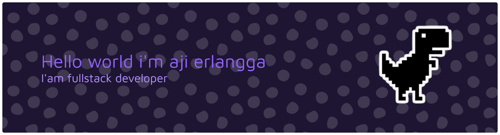

<div align="center">

# 👋 Aji Erlangga | Code. Learn. Build.



### 🎓 Student Developer

> Learning, building, and improving one project at a time.

</div>

---

## 👨‍💻 About Me

Hi, I'm **Aji Erlangga**, a student currently learning software development.

I'm interested in building websites, learning programming, and understanding how software works.

I'm still learning and experimenting, so this GitHub is where I document my journey, projects, and progress.

---

## 📖 Currently Learning

* 🌐 **Web Development**
* 🐍 **Python**
* ⚡ **JavaScript**
* 🔧 **Git & GitHub**
* 💻 **Programming Fundamentals**

---

## 🛠️ Tech Stack

### Languages

<p align="left">
  
</p>

<p align="left">
  
  
  
  
</p>

### Tools

<p align="left">
  
</p>

<p align="left">
  
  
  
</p>

---

## 🚀 Projects

I'm currently building small projects while learning.

| Project               | Status         |
| --------------------- | -------------- |
| 🌐 Personal Website   | 🟡 Learning    |
| 🐍 Python Projects    | 🟡 Learning    |
| ⚡ JavaScript Projects | 🟡 Learning    |
| 💻 More projects      | 🔵 Coming soon |

> Every project is part of the learning process.

---

## 🎯 2026 Goals

* ☐ Strengthen programming fundamentals
* ☐ Build more projects
* ☐ Improve JavaScript & Python
* ☐ Learn backend development
* ☐ Learn APIs & databases
* ☐ Build a personal portfolio
* ☐ Contribute to open source

---

## 💡 Learning Philosophy

> **Code. Learn. Build. Repeat.**

I don't need to know everything today.

I just need to keep learning and building.

---

## 🌱 My Journey

```text
2026
 │
 ├── Learning programming
 ├── Building projects
 ├── Exploring web development
 ├── Improving Git & GitHub
 └── Growing as a developer
```
---
<p data-importer="text" align="left">pixel-maze</p>

###

<picture data-importer="pacman">
  <source media="(prefers-color-scheme: dark)" srcset="https://raw.githubusercontent.com/ajierlanggaid-glitch/ajierlanggaid-glitch/pacman-output/pacman-contribution-graph-dark.svg?game=pacman">
  <source media="(prefers-color-scheme: light)" srcset="https://raw.githubusercontent.com/ajierlanggaid-glitch/ajierlanggaid-glitch/pacman-output/pacman-contribution-graph.svg?game=pacman">
  
</picture>

###


###

---

## 📫 Contact

* 🐙 GitHub — [@ajierlanggaid-glitch](https://github.com/ajierlanggaid-glitch)
* 📧 Email — [ajierlangga.id@gmail.com](mailto:ajierlangga.id@gmail.com)

---

<div align="center">

### ⭐ Thanks for visiting my profile!

**Aji Erlangga · Student Developer**

</div>
